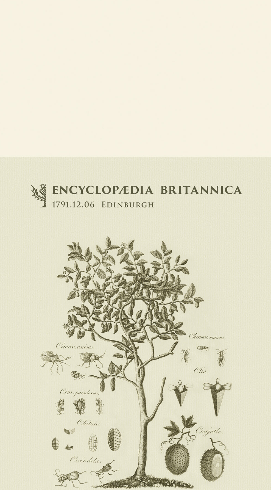
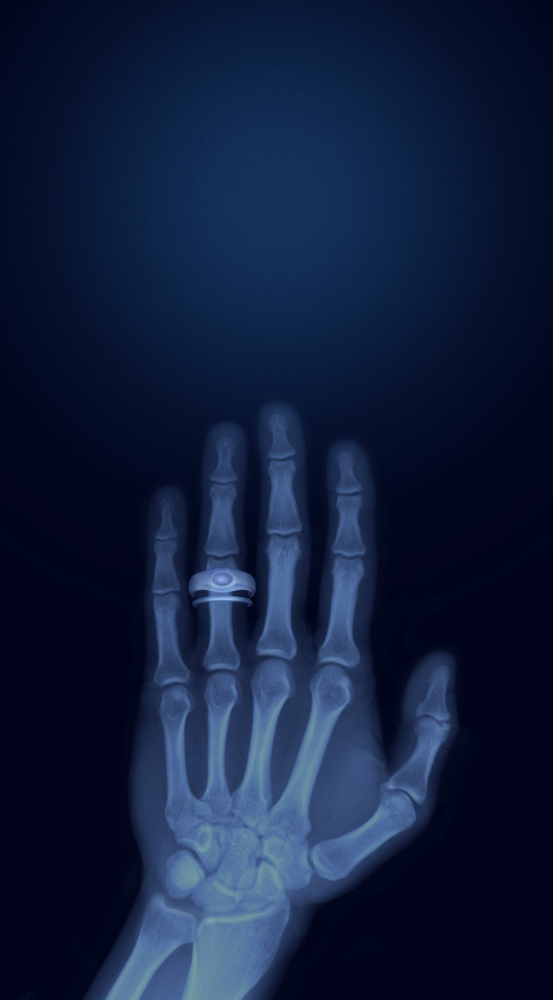
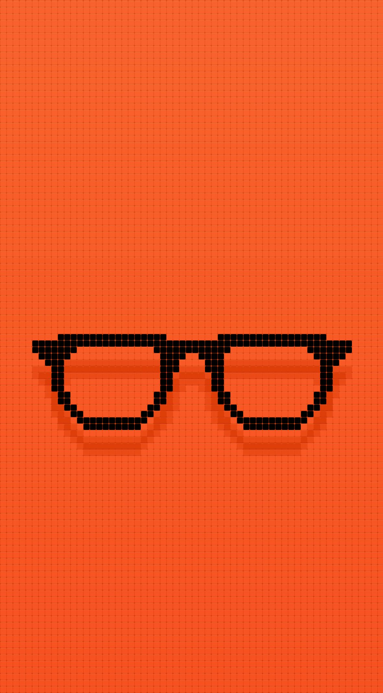
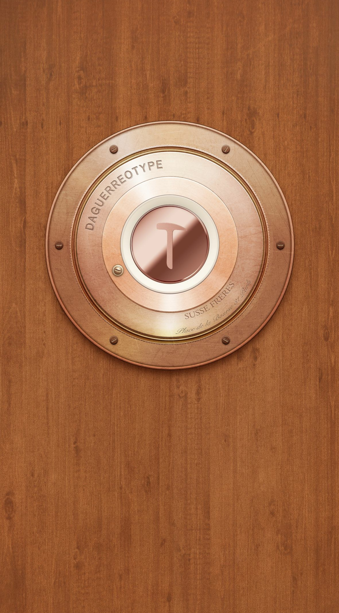
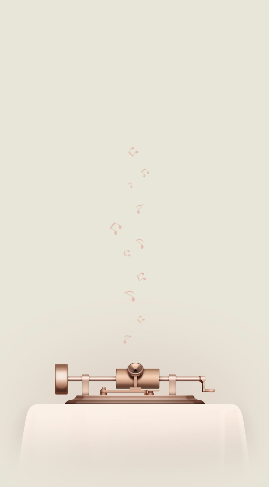

# smartisan-footprint-wallpapers
Wallpapers of Footprint series from Smartisan 锤子足迹系列壁纸

  
1571-12-27 约翰内斯·开普勒出生 Brithday of Johannes Kepler

  

  

  
1869-11-04 英国科学杂志《自然》出版 Nature's first publish

  

  
1846-10-16 人类首次公开使用乙醚 Ether's first use

  

  
1843-10-16 数学家汉密尔顿发现四元数 Quaternion discovered by mathematician William Hamilton in 1843

  

  
1917-10-31 世界最后一次成功的骑兵冲锋 Last great cavalry charge

  

  
1902-11-26 麦当劳创办人出生 Birthday of Richard McDonald & Maurice McDonald

  

  

  
1803-11-29 多普勒出生 Brithday of Christian Doppler

  

  
1957-11-03 第一只进入地球轨道的狗 First dog to be launched into Earth orbit

  

  
1973-10-20 澳大利亚悉尼歌剧院建成 Sydney Opera House founded

  

  
1768-12-6 《大英百科全书》出版 First publish of The Encyclopædia Britannica

  

  
1887-08-12 薛定谔诞生 Brithday of Erwin Schrödinger

  

  
1958-08-29 迈克尔·杰克逊诞生 Birthday of Michael Jackson

  

  
1890-09-15 阿加莎·克里斯蒂诞生 Birthday of Agatha Christie

  

  
1884-10-13 本初子午线 Prime Meridian adopted

  

  
1848-05-23 滑翔机之父李林塔尔出生 Birthday of Otto Lilienthal, the "flying man"

  

  
1984-06-06 电子游戏《俄罗斯方块》发布 Release date of Tetris

  

  
1960-06-16 《惊魂记》在美国首演 Psyco's initial release date

  

  
1898-06-17 画家埃舍尔出生 Birthday of Maurits Cornelis Escher

  

  
1900-06-29 《小王子》作者出生 Birthday of Antoine de Saint-Exupéry, author of The Little Prince

  

  
1928-07-07 切片面包被发明 Sliced bread was first sold

  

  
1969-07-20 人类首次登上月球 First land on Moon

  

  
1895-11-08 首次发现X射线 Date of X-ray was discovered

  

  
1945-12-06 微波炉面世 Microwave was invented

  

  
1935-11-30 伍迪·艾伦出生 Birthday of Woody Allen

  

  
1787-11-18 照相机发明者达盖尔出生 Brithday of Louis Daguerre, father of photography

  

  
1989-12-17 动画片《辛普森一家》首播 First episode date of The Simpsons

  

  
1831-12-27 达尔文开始五年的环球旅行 The round-the-world voyage by Charles Darwin started

  

  
1877-11-21 爱迪生宣布发明留声机 Phonograph invented by Thomas Edison

  

