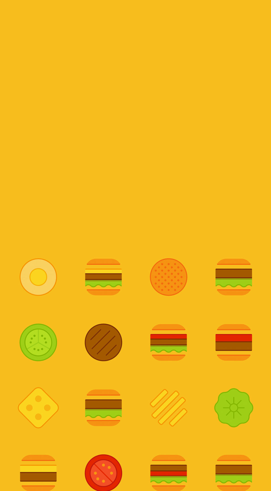
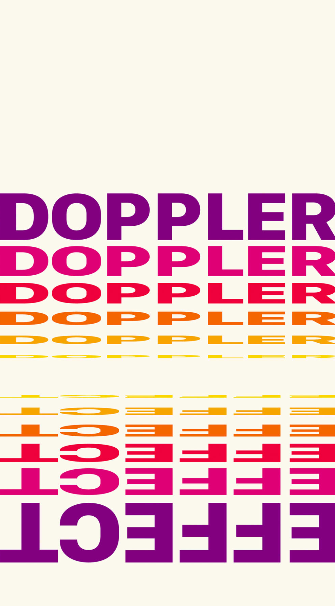
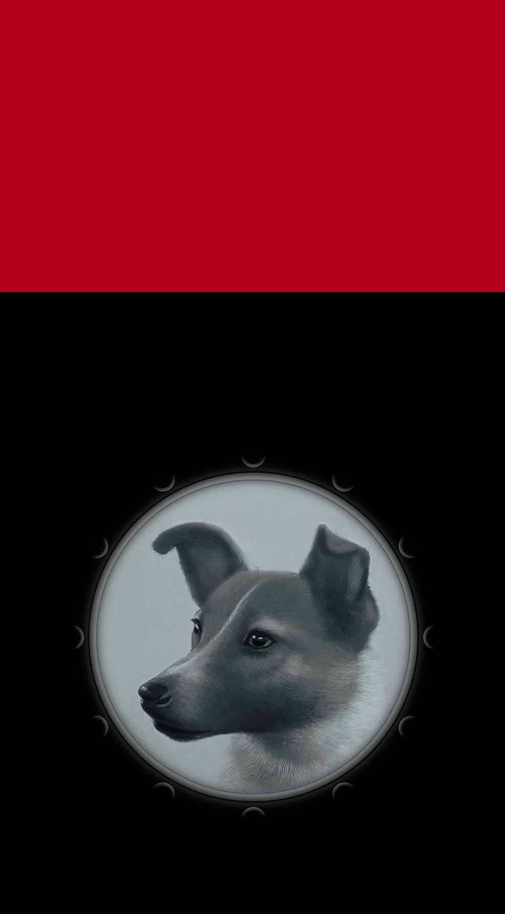

# smartisan-footprint-wallpapers
Wallpapers of Footprint series from Smartisan 锤子足迹系列壁纸

  
1571-12-27 约翰内斯·开普勒出生 Brithday of Johannes Kepler

  

  

  
1869-11-04 英国科学杂志《自然》出版 Nature's first publish

  

  
1846-10-16 人类首次公开使用乙醚 Ether's first use

  

  
1843-10-16 数学家汉密尔顿发现四元数 Quaternion discovered by mathematician William Hamilton in 1843

  

  
1917-10-31 世界最后一次成功的骑兵冲锋 Last great cavalry charge

  

  
1902-11-26 麦当劳创办人出生 Birthday of Richard McDonald & Maurice McDonald

  

  

  
1803-11-29 多普勒出生 Brithday of Christian Doppler

    

  
1957-11-03 第一只进入地球轨道的狗 First dog to be launched into Earth orbit

    

